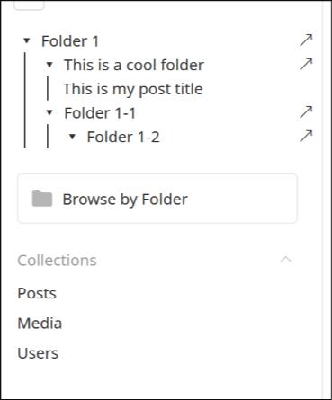

# 

## Introduction

> This plugin is currently in development, while useable many use-cases have not been developed. Issues found? Make an issue on Github!

Payload Folders Tree View is a plugin for Payload CMS that adds a collapsible folder tree to the Admin UI, making it easy to browse and find documents by folders across multiple collections. It leverages Payload’s built-in folders feature and injects a component into the admin navigation.



## Quick start
1) Install
```bash
pnpm add payload-folder-tree-view
```

2) Add to your payload config

```ts
import PayloadFolderTreeView from 'payload-folders-tree-view';

export default {
  plugins: [
   PayloadFolderTreeView(),
  ],
};
```

## Contributing

Contributions are welcome! To get started:

1. Fork the repository
2. Create a new branch (`git checkout -b feature/your-feature`)
3. Commit your changes
4. Open a pull request

Please see the [CONTRIBUTING.md](CONTRIBUTING.md) for more details.

## Need Help?

If you have questions or need support, open an issue on [GitHub](https://github.com/payloadcms/payload-folders-tree-view/issues), or find me on the Payload [discord](https://discord.com/invite/r6sCXqVk3v).

## Contributors
