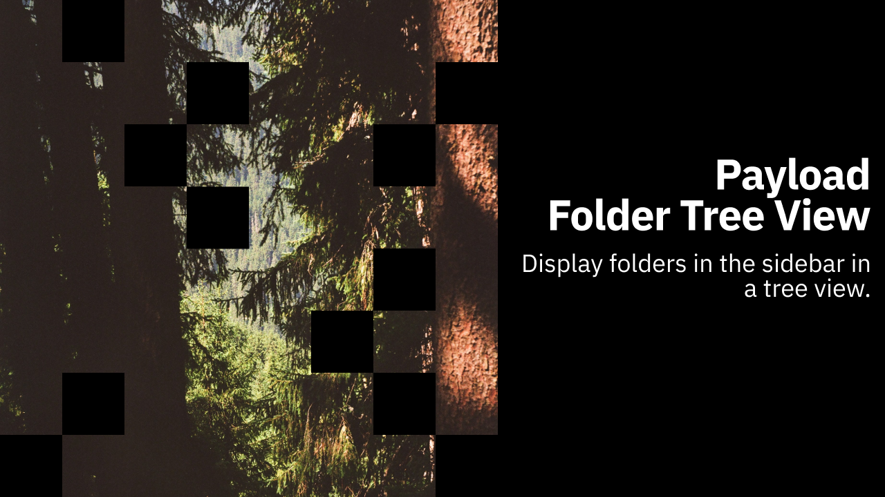

# 

## Introduction

Payload Folders Tree View is a plugin for Payload CMS that adds a collapsible folder tree to the Admin UI, making it easy to browse and find documents by folders across multiple collections. It leverages Payload’s built-in folders feature and injects a component into the admin navigation.

https://github.com/user-attachments/assets/8e6ab8fb-acd6-48a6-afaa-839c3ca0bbf2

## Quick start
This plugin is available on publicly on [npm](https://www.npmjs.com/package/payload-folder-tree-view).

1) Install
```bash
pnpm add payload-folder-tree-view
```

2) Add to your payload config

```ts
import { payloadFolderTreeView } from 'payload-folder-tree-view';

export default {
  plugins: [
   payloadFolderTreeView({
     showFiles: true,

     // Other options available
   }),
  ],
};
```

## Contributing

Contributions are welcome! To get started:

1. Fork the repository
2. Create a new branch (`git checkout -b feature/your-feature`)
3. Commit your changes
4. Open a pull request

Please see the [CONTRIBUTING.md](CONTRIBUTING.md) for more details.

## Need Help?

If you have questions or need support, 
- Open an issue on [GitHub](https://github.com/payloadcms/payload-folder-tree-view/issues)
- Find me on the Payload [discord](https://discord.com/invite/r6sCXqVk3v)
- Email me on [contact@patrickroelofs.com](mailto:contact@patrickroelofs.com).

## Contributors

